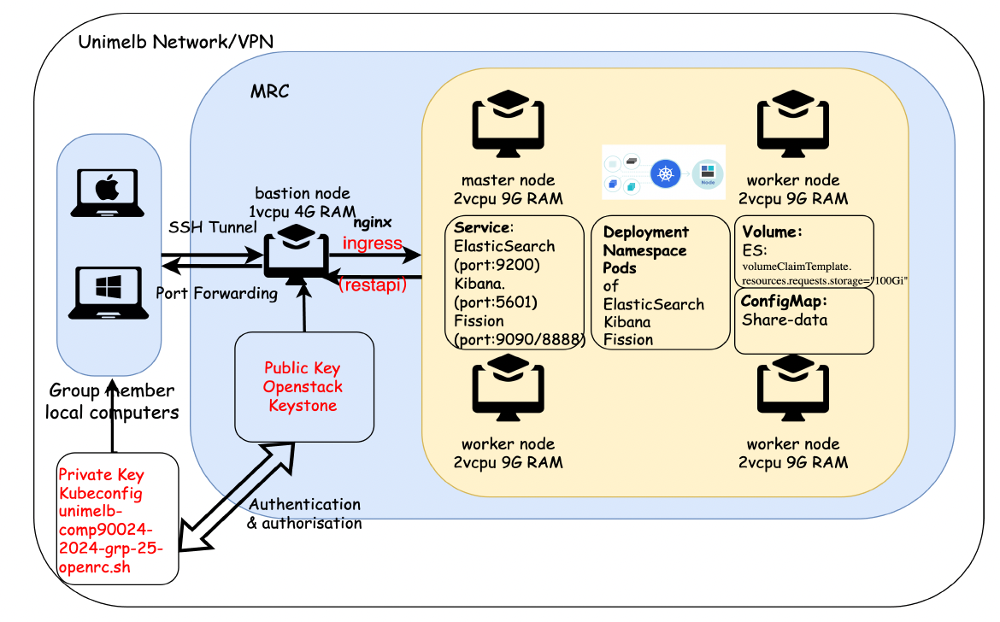
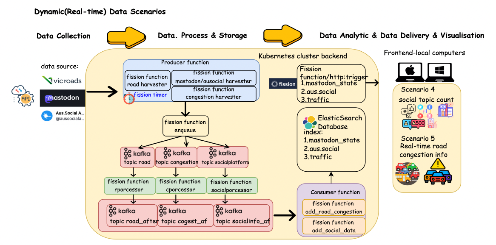
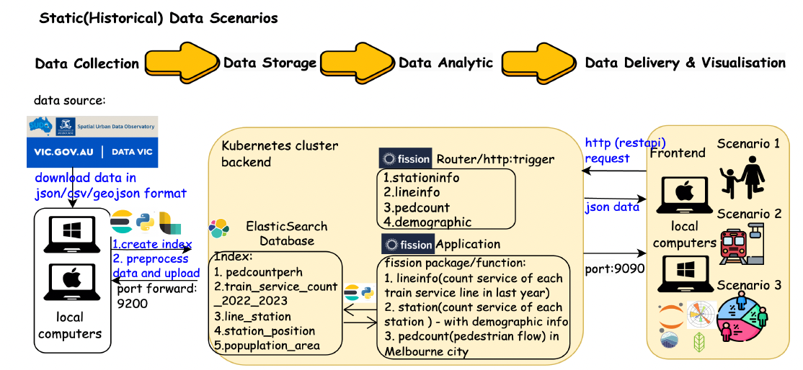
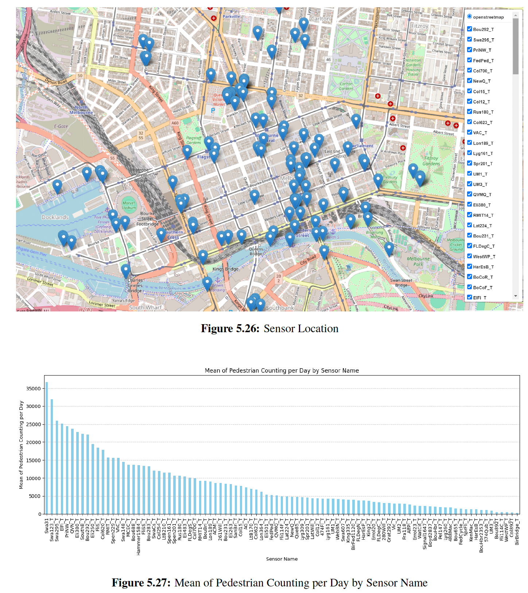
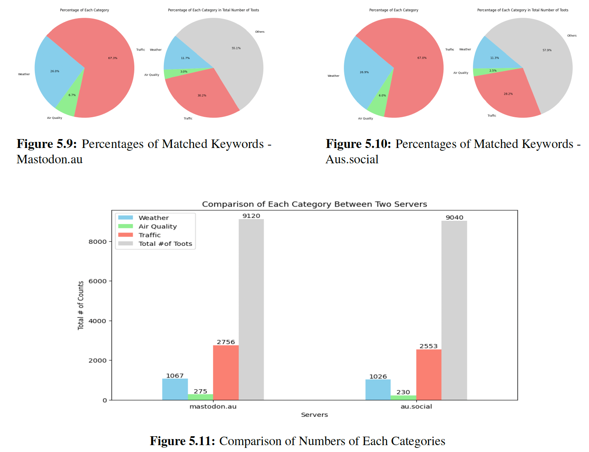
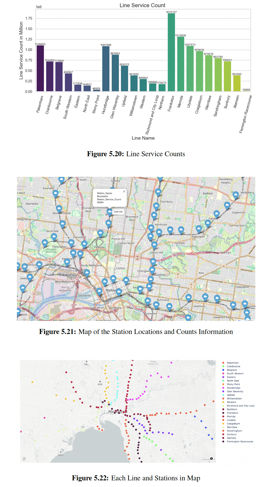
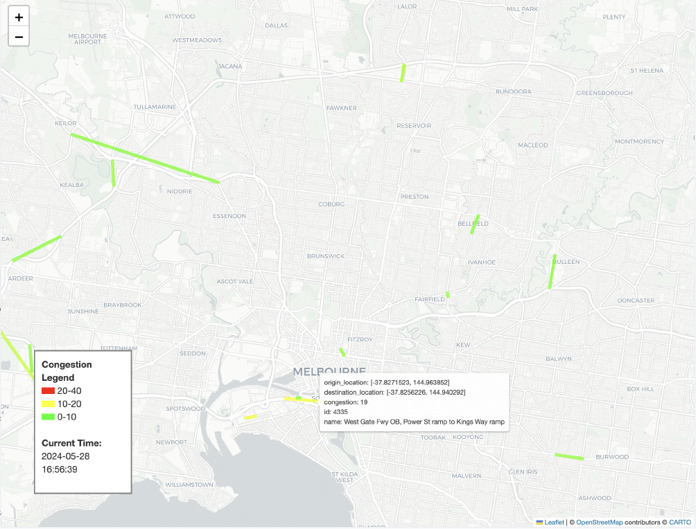
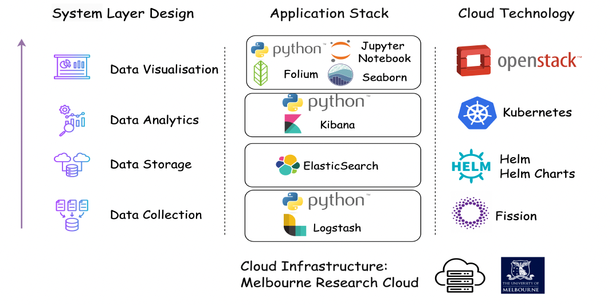

# Urban Data Cloud Pipeline  
### Scalable Cloud Infrastructure for Urban Transportation Analytics (Victoria, Australia)

Built a scalable cloud-native data pipeline using Kubernetes, Kafka, and Elasticsearch to analyse real-world urban mobility data.

---

## 🚀 Overview
This project builds a **cloud-native, distributed data pipeline** to analyse urban transportation dynamics across Victoria, integrating heterogeneous, large-scale data sources into a unified analytics platform.

The system processes and correlates data across five key domains:
- Pedestrian mobility  
- Regional population density  
- Public transport demand  
- Traffic congestion  
- Social media sentiment  

Designed and deployed on the **Melbourne Research Cloud (MRC)**, the platform demonstrates an end-to-end **data engineering and cloud systems workflow**, from ingestion to real-time analytics and visualisation.

---

## 🏗️ Architecture Overview

<p align="center">
  
</p>

---

## 🔄 Data Pipeline

### Real-time Pipeline
<p align="center">
  
</p>

### Static / Historical Pipeline
<p align="center">
  
</p>

---

## 🏗️ System Architecture

### High-Level Pipeline
Data Sources → Ingestion → Streaming → Processing → Storage → Visualisation

### Components

- **Data Ingestion**
  - API harvesters for SUDO, Mastodon, transport, and traffic datasets  

- **Streaming Layer**
  - Kafka enables asynchronous, scalable event-driven data flow  

- **Processing Layer**
  - Serverless functions using **Fission (on Kubernetes)**  
  - Stateless, horizontally scalable processing  

- **Storage Layer**
  - Elasticsearch for indexing, querying, and analytics  

- **Visualisation Layer**
  - Jupyter Notebooks with geospatial and statistical visualisation  

---

## 🛠️ Tech Stack

### Cloud & Infrastructure
- Kubernetes (cluster orchestration)  
- Helm (deployment management)  
- Fission (serverless functions)  
- Kafka (distributed streaming)  

### Data Engineering
- Python  
- Pandas, NumPy  
- JSON processing  

### Storage & Query
- Elasticsearch  

### Visualisation
- Jupyter Notebook  
- Folium (geospatial visualisation)  
- Seaborn, Matplotlib  
- ipywidgets  

---

## 📊 Key Features

- **Real-time data ingestion** from multiple urban data sources  
- **Scalable cloud processing** via Kubernetes + serverless architecture  
- **Streaming pipeline design** using Kafka  
- **Fast querying and indexing** with Elasticsearch  
- **Geospatial visualisation** of urban mobility patterns  
- **Cross-domain analytics** combining transport, population, and sentiment data  
---

## 📂 Project Structure
```
urban-data-cloud-pipeline/
│
├── backend/
│   ├── Data ingestion pipelines, processing logic, and deployment configurations
│   └── Includes Kubernetes (K8s) and Fission serverless setup
│
├── frontend/
│   ├── Data analysis notebooks and visualisation workflows
│   └── Supports exploratory analysis and presentation outputs
│
├── database/
│   ├── Elasticsearch index mappings and query definitions
│   └── Optimised for fast retrieval and analytics
│
├── data/
│   └── Sample datasets used for testing and demonstration
│
├── test/
│   └── Automated backend tests ensuring pipeline reliability
│
└── docs/
    ├── Final report, technical documentation, and architecture diagrams
    └── Includes supporting images and project artefacts
```

## 📈 Analytical Scenarios

### 1. Population Analysis (SUDO)
- Regional demographic distribution  
- Density trends across Victoria  

### 2. Social Media Sentiment (Mastodon)
- Sentiment analysis  
- Correlation with traffic, weather, and air quality  

### 3. Pedestrian Activity
- Foot traffic patterns across Melbourne CBD  
- Temporal and spatial trends  

### 4. Public Transport Usage
- Passenger flow analysis  
- Station-level demand insights  

### 5. Traffic Congestion
- Real-time congestion mapping  
- Spatial visualisation of road conditions  

---

## 📊 Example Outputs

### Pedestrian Analysis
<p align="center">
  
</p>

### Social Media vs Traffic
<p align="center">
  
</p>

### Transport Network
<p align="center">
  
</p>

### Traffic Congestion
<p align="center">
  
</p>

---

## ☁️ Cloud Infrastructure

<p align="center">
  
</p>

---

## 🌐 Data Sources

- Spatial Urban Data Observatory (SUDO)  
- Mastodon (mastodon.au, aus.social)  
- City of Melbourne Open Data Platform  
- Victoria Train Service Passenger Counts  
- VicRoads Traffic Data  

---

## ⚙️ Setup & Deployment

This system was deployed on the **Melbourne Research Cloud (MRC)**.

Full deployment requires:
- Kubernetes cluster  
- Fission (serverless framework)  
- Kafka  
- Elasticsearch  

Reference setup:  
https://gitlab.unimelb.edu.au/feit-comp90024/comp90024/-/tree/master  

---

## 🧠 Key Learnings

- Designing **distributed, scalable data pipelines**  
- Implementing **event-driven architectures (Kafka)**  
- Deploying **serverless functions on Kubernetes**  
- Handling **large-scale, real-world datasets**  
- Building **end-to-end data engineering systems**  

---

## 🎯 Impact & Applications

- Supports **data-driven urban planning decisions**  
- Enables **real-time transportation insights**  
- Demonstrates production-style **cloud data engineering architecture**  

---

## 👥 Team

- Yechen Deng  
- Binghong Xing  
- Chenxi Yao  
- Mingyang Yao  
- Ziying Zhang  

---

## 📄 License
This project is licensed under the MIT License.
